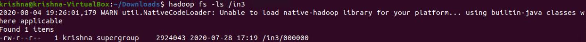
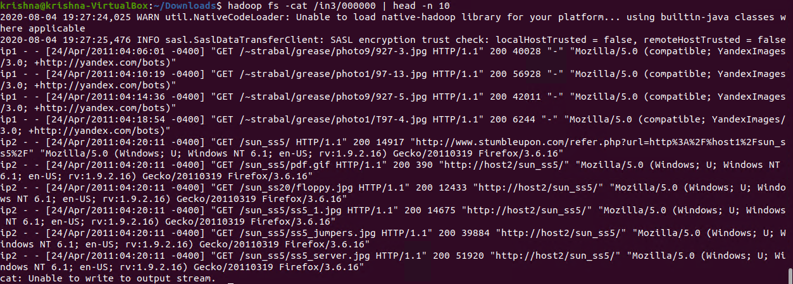
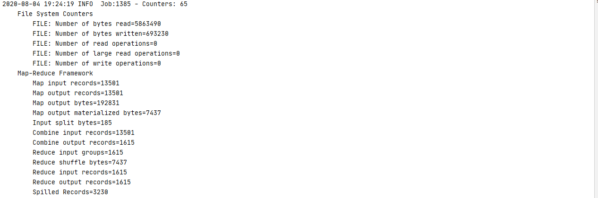
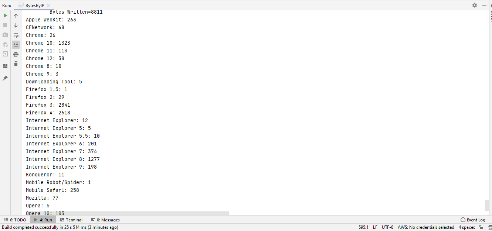
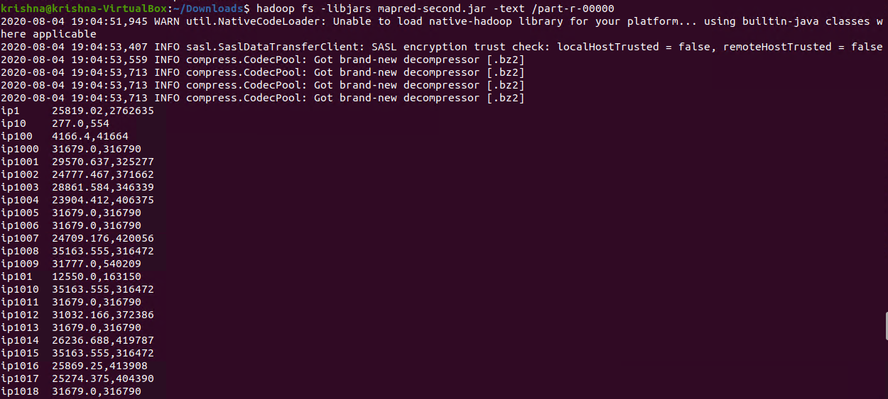
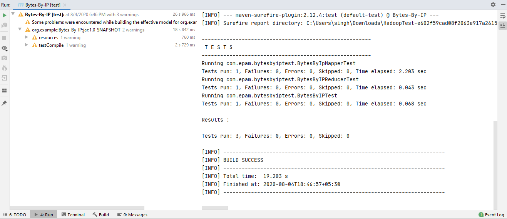

# Mapreduce Count Average Bytes per request by IP-and Total Bytes by IP
-----------------------

## MapReduce

* Data processing layer in Hadoop. 
* Processing structured & Unstructured Data in Hadoop.

## Pros

* Best Performance 

## Cons 

* Hard to Extend 
* Lack of management tools
* Not suitable for real time processing
* very small community

## Input Directory

Input directory contains input files that will be processed by MapReduce to count average bytes per request by IP and total bytes by IP.

  

In the above screenshot, we can see an input directory (in) contains input file – 000000 provided with problem statement.  

## 000000
 
  
 
In the above screenshot, we can see the content of the input file.  

## Counters usage
 
  

In the above screenshot, we can see that 65 counters are used with read and written bytes.

## Counters Output

  
 
In the above screenshot, we can see the output of the counters.  

## Reading Compressed Content

  

In the above screenshot, we can see the output contains IP, Average bytes & Total Bytes.  
Note: I used Bip2Codec because snappy is not supported by the latest versions of Hadoop.  

## Test Cases:

  
 
In the above screenshot, we can see that all 3 test cases have passed.  

**Created by:**  
**Name: Krishna Kumar Singh**  
**Email: krishnaai265@gmail.com**  
**Phone: +91-9368754996** 
